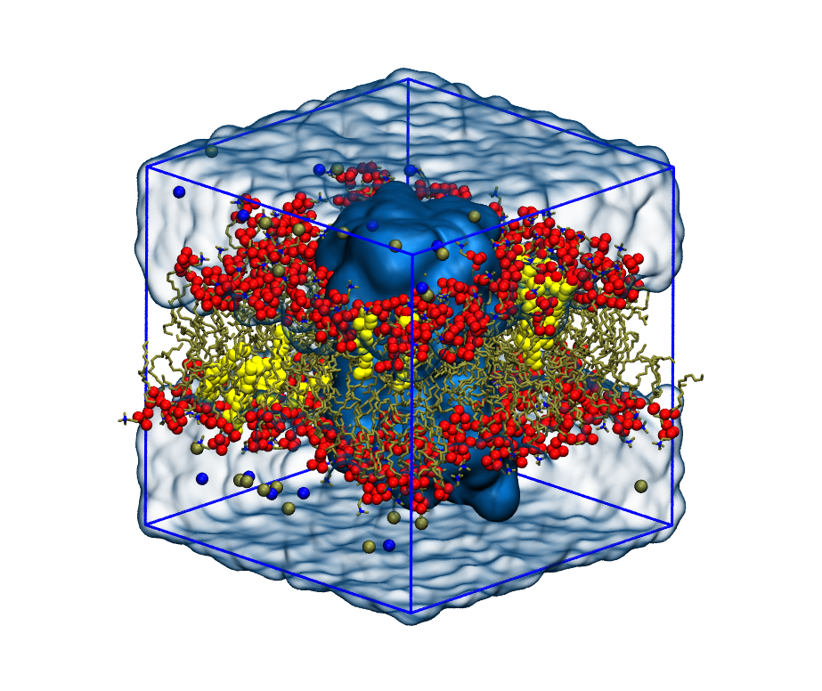

# MD in a membrane environment



Welcome to the repository for the 12/01/2021 lecture on MD of bilayers and membrane proteins.

## Distribution

Under [theory/](theory/) you have the theoretical presentation to the topic. Under [practical/](practical/) you have a [protocol](practical/README.md) with the different steps to be followed to:
- Build, minimize, equilibrate, simulate and analyze a POPC membrane system (under [just_popc/](practical/just_popc)).
- Build and analyze a POPC+CHL membrane system (under [popc+chl/](practical/popc+chl)).
- Build and analyze a POPC+CHL membrane system with an embedded membrane protein (under [membrane_protein/](practical/membrane_protein)).

## Main software

- [PACKMOL-memgen](https://pubs.acs.org/doi/10.1021/acs.jcim.9b00269) to build the systems.
- [GROMACS](https://manual.gromacs.org/) to prepare, simulate and analyze the simulations.
- [FATSLiM](http://fatslim.github.io/) to analyze the membranes in the simulations.

## Setting up

We're gonna be using [miniconda](https://docs.conda.io/en/latest/miniconda.html) to manage the software needed for the protocol to work. So, to download and install it:

```
wget https://repo.anaconda.com/miniconda/Miniconda3-latest-Linux-x86_64.sh
chmod +x Miniconda3-latest-Linux-x86_64.sh
./Miniconda3-latest-Linux-x86_64.sh
```

Follow the instructions.

Once you have it installed, you probably have to restart your terminal or do `source ~/.bashrc`.

Now we're going to create an environment with all the packages needed and a compatible python version:

```
conda create -n membranes python=3.5
conda activate membranes
```

> Probably gonna ask you to do a `conda init bash`.

```
conda install numpy pandas matplotlib pytest
```

Say `Y`.

To install FATSLiM and test if it works:

```
pip install fatslim
fatslim self-test
```

Then, the AMBER-to-GROMACS converter:

```
pip install acpype
```

And finally, the secondary-structure predictor DSSP:

```
sudo apt-get install dssp
```

GROMACS should be installed. PACKMOL-memgen should be available with the AmberTools19 suite.

To start working with the practical part, `git clone` this repo anywhere you want in your local machine and follow the steps of the [protocol](practical/README.md).