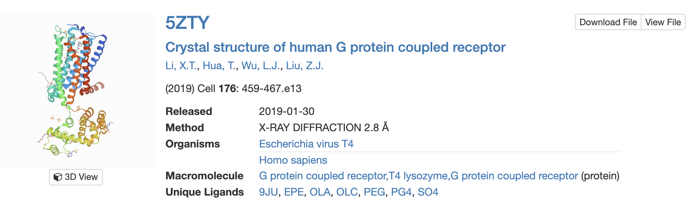

# Protocol

## Simple membrane system

### Just POPC

This part of the protocol will be done under `just_popc/`:

```
cd just_popc
```

#### Membrane creation with [packmol-memgen](https://pubs.acs.org/doi/10.1021/acs.jcim.9b00269)

First, we're going to create a membrane with just POPC. With the following command, we're defining a 75x75 A membrane.

```
packmol-memgen --lipids POPC --distxy_fix 75
```

> Note: we're not adding any concentration of ions. Ideally there should be a salt concentration of 0.15M to replicate more accurately the real conditions. However, for the purposes of the tutorial, we're not adding any. Our system is already neutral so it won't necessarily affect the electrostatics.

The process will likely take about 5 minutes.

Once it's done, you can check the resulting membrane with VMD:

```
vmd bilayer_only.pdb
```


#### Transformation to GROMACS

In this part, we're going to obtain the amber ff parameters (version 14SB) for the system:

```
cp ../files/leap.in .
tleap -f leap.in
acpype -x system.inpcrd -p system.prmtop -o gmx
```

With `leap` we process the system (from the output pdb file) and obtain the parameters for [AMBER](http://ambermd.org/) (.PRMTOP and .INPCRD). However, we're simulating it with [GROMACS](https://manual.gromacs.org/), so we need to transform them to a .TOP and .GRO files, by means of `acpype`.

Because newer versions of `acpype` create an output folder for the files, we need to copy the outputs in our working directory, by doing that:

```
cp system.amb2pdb/system_GMX* .
```

#### Preparation

Copy the "molecular dynamics parameters" files for the following part:

```
cp -r ../files/mdp .
```

##### Energy minimization

Once we have the necessary files for a simulation with GROMACS, we're going to continue with a short minimization (1000 steps). Open the file `mdp/min.mdp` to check what we're doing first.

Then, execute these two commands:

```
gmx grompp -f mdp/min.mdp -r system_GMX.gro -c system_GMX.gro -p system_GMX.top -o system_min.tpr -maxwarn 1
gmx mdrun -deffnm system_min -v
```

With the first command we generate the mdrun input file (.TPR), and with the second we perform the actual calculation. Once it's done, we need to equilibrate the system.

##### Equilibration

We're going to perform a **three step equilibration** of our system ona a NPT ensemble. 

Before doing that, we need to add these three lines in the `system_GMX.top` before the section (i. e. fractions of text/syntax between in brackets in GROMACS files):

```
...

[ molecule type ]
;molname    nrexcl
WAT         2

...
```

To make it look like this:

```
...

#ifdef POSRES
#include "posre.itp"
#endif

[ molecule type ]
;molname    nrexcl
WAT         2

...
```

Run the following command:

```
chmod +x equi.sh
./equi.sh
```

And now check the three equilibration files in the `mdp/` folder (`equi*.mdp`). Check the differences among them.

> HINT: you can use `vimdiff` followed by the files to compare them to spot the differences more easily.

Also, check the script we're executing, and figure out what are the `gmx genrestr` and `gmx make_ndx` commands doing.

The whole equilibration will probably take a long while. **So, we're not gonna wait for all the steps to finish. Kill the process and copy the `just_popc/system_equi1*` files from the shared OneDrive link provided at the beginning of the class, and continue with the protocol.**

Now, visualize the time-evolution of the trajectory of the first equilibration step (equi1), with vmd:

```
vmd system_min.gro system_equi1.xtc
```

> The .TRR file in GROMACS contains the actual trajectory, but it's best to visualize it using the compressed file .XTC

We're also going to assess some of the variables during the first equilibration step. We can do that using GROMACS's analysis tools, in this case we're using `gmx energy`:

```
gmx energy -f system_equi1.edr -o equi1.xvg
```

And then, we will pick the variables we want to assess by typing the following numbers: 

`12 14 15 20 21 0`

This way we're selecting the **total energy of the system**, **temperature**, **pressure**, **density** and **volume**. The final zero exits the prompt.

To visualize the file you can either use `xmgrace` or execute the following python script:

```
python ../files/plot_xvg.py equi1.xvg
```

It outputs a PNG image on the same location where the .XVG file is. See how the different variables change along time until stabilized.

#### Production

Now we're ready to send the calculation. We're going to do a 100 ns long unbiased MD simulation.

```
gmx grompp -f mdp/prod.mdp -r system_equi3.gro -c system_equi3.gro -p system_GMX.top -o system_prod.tpr -n index.ndx -maxwarn 1
gmx mdrun -deffnm system_prod -v
```

Okay, so you're going to notice that this is going to take too long to finish. That's why we're not going to wait until it's done. You can get the output in the same shared OneDrive link.

#### Analysis

What we're going to do now is a bit of analysis of our membrane. The two typical measurements to assess are the **membrane thickness** and the **area per lipid (APL)**. So as to do that, we're going to use [FATSLiM](http://fatslim.github.io/) a package ready to analyze membrane simulations.

Before doing that you can also check how it visually looks like:

```
vmd system_equi3.gro system_prod.xtc
```

##### Membrane thickness

To determine membrane thickness the command to be used:

```
fatslim thickness -c system_equi3.gro -t system_prod.xtc -n index.ndx --plot-thickness thickness.xvg
```

The software will give us the thickness per leaflet and for the whole membrane. Moreover, with the option `--plot-thickness` we can obtain a plot of the thickness over time. You can again use `xmgrace` or `plot_xvg.py` to visualize the plot.

##### Area per lipid (APL)

In this case, we will use:

```
fatslim apl -c system_equi3.gro -t system_prod.xtc -n index.ndx --plot-apl apl.xvg
```

And, just like before, the APL per leaflet, for the whole membrane, and a plot over time is generated.

### POPC+CHL

This part of the protocol will be done under `popc+chl/`:

```
cd ../popc+chl
```

Now we're going to simulate a membrane with a ratio of 1 cholesterol molecule per 3 of POPC. Create the membrane with packmol-memgen to begin with:

```
packmol-memgen --lipids POPC:CHL1 --ratio 3:1 --distxy_fix 75
```

Check how it looks like again with `vmd`. Spot where the cholesterol molecules are.

In the same OneDrive link provided before there's also a 100 ns simulation of a similar POPC+CHL membrane system. Repeat the previous analysis to measure the membrane thickness and APL.

## Protein-Membrane system

This part of the protocol will be done under `membrane_protein/`:

```
cd ../membrane_protein
```

### Building the system

In here we're going to create a bilayer for a membrane protein. Our membrane protein is a refined structure of the Cannabinoid Receptor 2 (CB2). 



Run the following command:

```
packmol-memgen --pdb protein.pdb --lipids POPC:CHL1 --ratio 10:1 \
    --dist 12 --dist_wat 15 --salt --salt_c Na+
```

What we're doing now is building a bilayer for our protein, 12 A to the edges of the box in the X and Y axis, 15 A in the Z axis, and with a concentration of salt of 0.15 M (need to specify the cation).

Check the output .PDB with vmd:

```
vmd bilayer_protein.pdb
```

We're not gonna go over again the steps we followed before because it's probably gonna take even longer than the previous parts. So we're going to go straight to the analysis part. 

### Analysis

In the same OneDrive link, a 100 ns trajectory of a system (similar) to the one you've created. That is a CB2 receptor embedded in a 10:1 POPC:CHL membrane, with 0.15 M NaCl. We're going to proceed now to the analysis of some variables concerning the membrane protein.

#### RMSD

We're gonna first measure the RMSD of the C-alpha atoms of our receptor along the trajectory. This can be done with GROMACS:

```
gmx rms -f system_prod.xtc -s system_equi6.gro -o rmsd.xvg
```

Select the "C-alpha" group twice (type "3", press Enter, and type "3" again). GROMACS will automatically align all the coordinates and calculate the RMSD for the C-alpha atoms of our protein.

You can again plot it with the python script.

#### RMSF

Now we're going to calculate the RMSF of the structure througout the simulation. This will help us determine how stable are our transmembrane alpha-helices. 

```
gmx rmsf -f system_prod.xtc -s system_equi6.gro -o rmsf.xvg
```

Select "C-alpha" as well. And again, plot it with whatever you want.

#### Secondary Structure analysis

Finally we're going to perform a simple SS analysis to further assess the stability of the TM helices.

First of all, point GROMACS to the DSSP executable:

```
which dssp
```

`which` will tell you where `dssp` is in your machine. Then, create a global variable called `$DSSP` for GROMACS:

```
export DSSP="path/to/dssp"
```

Then, to avoid `Segmentation fault` errors, we will extract only the protein coordinates time-evolution from the trajectory. We will have to do that for both the coordinates and the trajectory, by means of GROMACS' `trjconv` command:

> In both cases you'll have to select "Protein" as the group to extract in the prompt.

```
gmx trjconv -f system_equi6.gro -s system_equi6.gro -o protein.gro -pbc nojump
gmx trjconv -f system_prod.xtc -s system_equi6.gro -o protein.xtc -pbc nojump
```

> `-pbc nojump` option accounts for PBC jumps on the trajectory. The protein may have visited one the periodic images, and so the structure may appear deformed. We want to avoid that.

And execute the GROMACS command:

``` 
gmx do_dssp -f protein.xtc -s protein.gro -o ss.xpm -ver 2
```

Select the "Protein" group. GROMACS will generate a pixelmap (.XPM) that needs to be transformed into an encapsulated PostScript file to be visualized. So execute the following command:

```
gmx xpm2ps -f ss.xpm -o ss.eps
```

The axis may be difficult to read. On the X-axis there's the time (in ps) of the simulation (from left to right). On the Y-axis there are the protein residues (from bottom to top).
